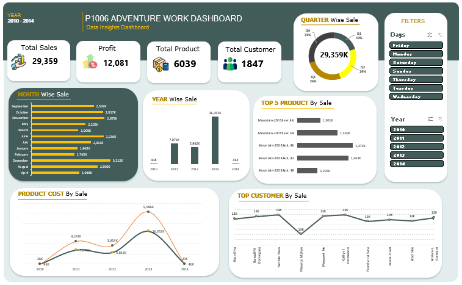
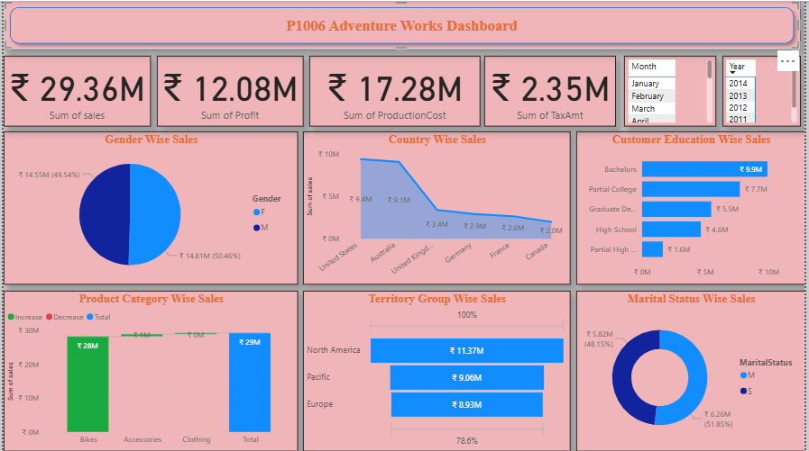
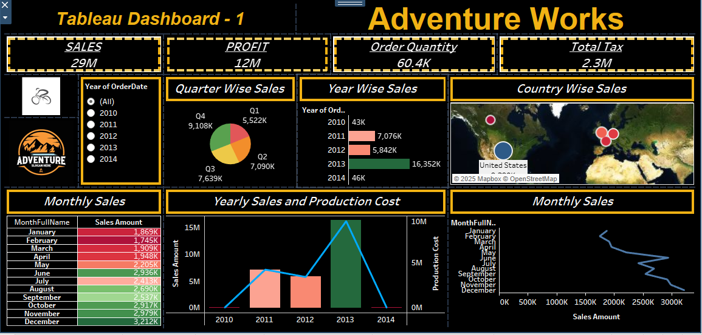

# 🚴‍♀️ Adventure Works Analysis

## 📘 Project Overview

Adventure Works Cycles is a multinational manufacturer and retailer of bicycles operating across **North America, Europe, and Asia**.
The purpose of this project is to analyze **sales, profit, customer, and product performance** from **2010–2014** to identify key growth drivers, high-value customers, and regional sales opportunities.
The analysis supports strategic decisions related to product performance, customer segmentation, and profitability trends.

---

## ⚙️ Tools & Technologies Used

* **SQL:** Data extraction, integration, and transformation
* **Excel:** Data cleaning and KPI dashboard creation
* **Power BI:** Interactive visualization and trend analysis
* **Tableau:** Geographical insights and advanced analytics

---

## 🧩 Dataset Details & Model

The dataset is based on the **Adventure Works Cycles** sales model and follows a **star schema** structure.

### Fact Tables

| Table Name              | Description                 | Rows   |
| ----------------------- | --------------------------- | ------ |
| Fact_Internet_Sales     | Internet sales transactions | 5,628  |
| Fact_Internet_Sales_New | Updated sales transactions  | 54,772 |

### Dimension Tables

| Table Name            | Description                                                   | Rows   |
| --------------------- | ------------------------------------------------------------- | ------ |
| DimCustomer           | Customer demographics & income                                | 18,485 |
| DimProduct            | Product details, cost, and price                              | 607    |
| DimProductSubCategory | Product subcategories                                         | 37     |
| DimProductCategory    | Product categories (Bikes, Components, Clothing, Accessories) | 4      |
| DimSalesTerritory     | Regional mapping (North America, Europe, Pacific)             | 10     |
| DimDate               | Date and fiscal information                                   | 3,653  |

---

## 🧹 Data Preparation & Transformation

1. **Data Integration:** Combined `Fact_Internet_Sales` and `Fact_Internet_Sales_New` into a single unified dataset.
2. **Data Enrichment:** Joined with dimension tables to append product, customer, and region details.
3. **Date Transformation:** Converted `OrderDateKey` into readable date format; extracted *Year, Month, Quarter,* and *Weekday*.
4. **Calculated Columns:**

   * `SalesAmount` = (Unit Price × Order Quantity) – Discount
   * `ProductionCost` = (Standard Cost × Quantity)
   * `Profit` = SalesAmount – ProductionCost
5. **Data Modeling:** Established relationships between fact and dimension tables using a **star schema** for better analytical performance.

---

## 📈 Key Metrics (KPIs)

| Metric                      | Value                                  |
| --------------------------- | -------------------------------------- |
| **Total Sales (2010–2014)** | 29.3K+                                 |
| **Total Profit**            | 12K+                                   |
| **Total Products Sold**     | 6,039                                  |
| **Total Customers Served**  | 1,847                                  |
| **Top-Selling Product**     | *Mountain-200 Silver, 42 (3.6K units)* |
| **Top Customer**            | *Victoria Ashworth (13K in sales)*     |
| **Most Profitable Year**    | 2013                                   |
| **Best Quarter**            | Q4 (28% of total sales)                |
| **Peak Month**              | September (3.2K+ sales)                |

---

## 💡 Business Insights

* Despite strong total sales (**29.3K+**), profit remains moderate (**12K+**), indicating possible **high operational costs** or **discount-driven sales**.
* A significant **sales spike in 2013** reflects either a **successful campaign** or **new product launch**.
* **Q4** accounts for the highest revenue (28% of sales), showing strong **year-end seasonal demand**.
* A small group of products, mainly the **Mountain-200 series**, dominate sales — indicating reliance on **limited high-performing SKUs**.
* **Customer loyalty is high** — 1,847 customers contributed to overall 29K+ sales.
* **Friday and weekend** purchases are most frequent, useful for **targeted promotions**.
* Rising production cost trends in 2013 suggest **premium product demand** driving revenue growth.

---

## 🖼️ Dashboard Gallery

### 🧾 Excel Dashboard

Features: Month, Quarter, and Year-wise trends; KPIs for total sales, profit, products, and customers; top-selling products and customers.

**📂 Dashboard File:** [View Excel Dashboard](dashboard1.png)

---

### 📊 Power BI Dashboard

Features: Gender, Country, Education, Marital Status, and Territory-wise insights.
Visualizes total sales (₹29.36M), profit (₹12.08M), production cost (₹17.28M), and tax (₹2.35M).

**📂 Dashboard File:** [View Power BI Dashboard](dashboard2.png)

---

### 🌍 Tableau Dashboard

Features: Global sales map, quarterly and yearly sales performance, and monthly sales patterns.
Helps visualize regional distribution and production cost comparison.

**📂 Dashboard File:** [View Tableau Dashboard](dashboard3.png)

---

**🧾 SQL File:** [Download MySQL Script](https://github.com/Poonamgade73/Data-Analytics-Portfolio/blob/main/AdventureWorks-Analysis/AdventureWorksAnalysis.sql)

---

## 🧠 Key Learnings

* Hands-on experience with **data extraction (SQL)** and **data cleaning (Excel)**.
* Developed a complete **data model** and performed advanced **data transformations**.
* Designed **interactive dashboards** in Power BI and Tableau to communicate business insights effectively.
* Improved **data storytelling, visualization**, and **presentation skills** for business decision-making.

---

## 🏁 Conclusion

This project delivers a holistic analysis of Adventure Works’ global sales performance from 2010–2014.
Through SQL-driven transformation and visualization across Excel, Power BI, and Tableau, it highlights the company’s profitability trends, product efficiency, and customer patterns — providing actionable insights for strategic business growth.

---

