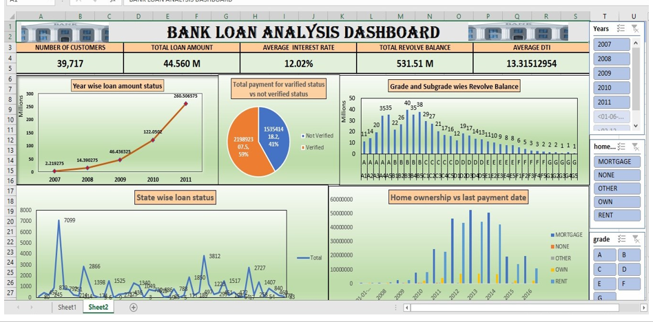
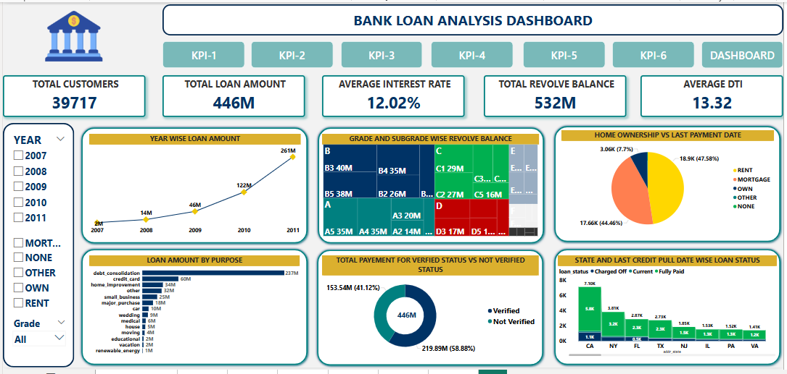
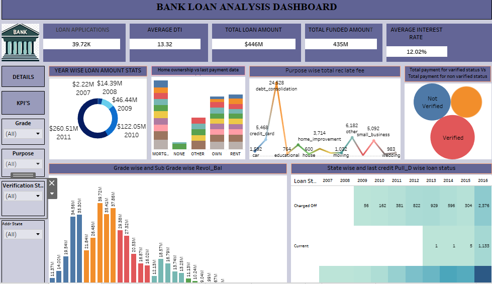

# 🏦 Bank Loan Analytics Project

## 📌 Project Overview
Banks face challenges in tracking loan performance and understanding customer spending patterns.  
This project analyzes loan data to uncover key insights and support better financial decision-making. Multiple BI tools and SQL were used to clean, transform, visualize, and analyze the data.

## 🧰 Tools & Technologies Used
- Excel (Power Query, Charts)  
- Power BI  
- Tableau  
- SQL (MySQL)  
- Git & GitHub  

## 🗂️ Dataset Information
- **Source:** Internship-provided dataset  
- **Records:** 39,000+ customer loan records  
- **Format:** Excel / CSV  
- **Contains:** Customer demographics, loan amounts, interest rates, home ownership, payment verification, loan purpose, and loan status  

## 🚀 Project Workflow
1. Data cleaning and transformation using Excel Power Query  
2. KPI calculation and visualization in Excel  
3. Interactive dashboard creation in Power BI for real-time monitoring  
4. Additional visual perspectives in Tableau  
5. KPI queries and data validation using SQL  
6. Reporting and deriving insights  

## 📊 Dashboards

### 🟡 Excel Dashboard

### 🟢 Power BI Dashboard

### 🔵 Tableau Dashboard

---

## 🧮 SQL Queries & Outputs
- Year-wise loan growth  
- Grade-wise revolve balance  
- Verified vs. non-verified payments  
- State-wise loan status  
- Home-ownership repayment trends  

-- 1. Year-wise Loan Amount Stats

SELECT 
    SUBSTRING(issue_d, 5, 2) AS year, 
    SUM(loan_amnt) AS total_loan_amount 
FROM finance_1
GROUP BY SUBSTRING(issue_d, 5, 2)
ORDER BY year;

-- 2.  Grade and Sub-grade Wise Revolving Balance

SELECT 
    f1.grade, 
    f1.sub_grade, 
    SUM(f2.revol_bal) AS total_revolving_balance
FROM finance_1 f1
JOIN finance_2 f2 ON f1.id = f2.id
GROUP BY f1.grade, f1.sub_grade
ORDER BY f1.grade, f1.sub_grade;

-- 3.  Total Payment for Verified vs Non-Verified Status

SELECT 
    f1.verification_status, 
    SUM(f2.total_pymnt) AS total_payment_received
FROM finance_1 f1
JOIN finance_2 f2 ON f1.id = f2.id
GROUP BY f1.verification_status;

-- 4. State-wise and Month-wise Loan Status

SELECT 
    addr_state, 
    SUBSTRING(issue_d, 1, 3) AS month, 
    loan_status, 
    COUNT(*) AS count
FROM finance_1
GROUP BY addr_state, SUBSTRING(issue_d, 1, 3), loan_status
ORDER BY addr_state, month;

-- 5. Home Ownership vs Last Payment Date Stats

SELECT 
    f1.home_ownership, 
    AVG(f2.last_pymnt_amnt) AS avg_last_payment
FROM finance_1 f1
JOIN finance_2 f2 ON f1.id = f2.id
GROUP BY f1.home_ownership;

## 📈 Key Insights
- Total loan amount: **₹446M**, Revolve balance: **₹532M**  
- **59%** of loans were unverified  
- **Debt consolidation (₹60M)** was the top loan purpose  
- States with highest loan volumes: **CA, NY, FL**  
- DTI ratio: **13.32**, Average interest rate: **12.02%**

## 📚 Learnings
- End-to-end data analysis using multiple BI tools and SQL  
- KPI calculation and validation across Excel, Power BI, and Tableau  
- Data storytelling and presentation skills  
- Exposure to credit risk analysis and borrower behavior  

## 🏆 Future Enhancements
- Automating data refresh and ETL pipelines  
- Integrating predictive analytics for risk assessment  
- Enhancing comparative dashboards with advanced filters  

## 📄 Project Report
[Download Project Report](.pdf)

## 📧 Contact
**Poonam Gade**  
[LinkedIn](https://www.linkedin.com/in/your-link) | [GitHub](https://github.com/your-username)
