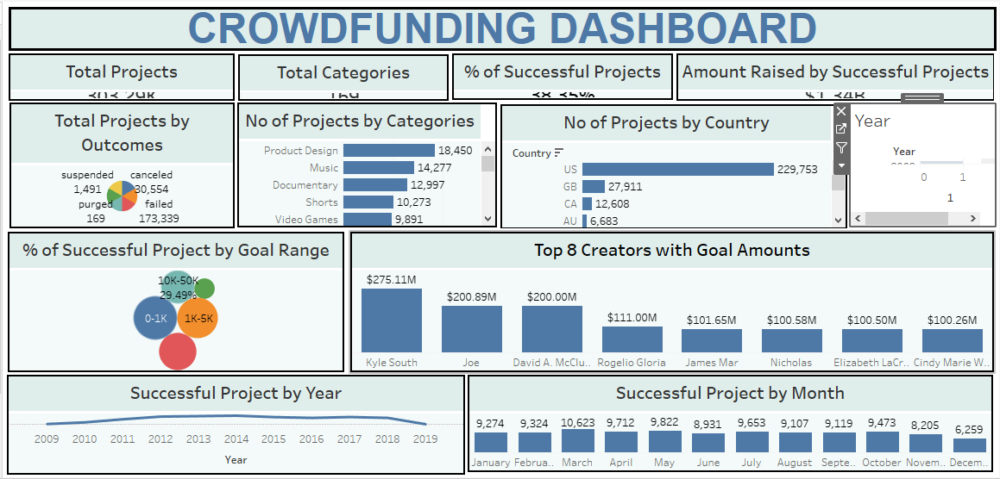

---

# 💰 Crowdfunding Analysis

## 📘 Project Overview

Crowdfunding has become one of the most popular methods for raising capital for innovative ideas. However, a large percentage of projects fail to reach their funding goals because creators often lack insights into what drives success — such as **goal amount, duration, category, and region**.

This project analyzes **365K+ crowdfunding campaigns** to uncover key factors influencing success, failure, and overall funding trends.
The goal is to help **creators, investors, and platforms** make more data-driven decisions and improve campaign outcomes.

---

## ⚙️ Tools & Technologies Used

* **SQL:** Data extraction, transformation, and analysis
* **Excel:** Data cleaning and preprocessing
* **Power BI:** Dynamic visual dashboards for trends and regional analysis
* **Tableau:** Interactive storytelling of project performance and patterns

---

## 🧩 Dataset Details & Model

| Table Name            | Description                                                            | Rows    |
| --------------------- | ---------------------------------------------------------------------- | ------- |
| **Projects**          | Campaign-level details: goal amount, amount raised, duration, outcomes | 365,893 |
| **Creator**           | Information about project owners                                       | 334,842 |
| **Location**          | Geographic details                                                     | 23,253  |
| **Category**          | Project classifications (Product Design, Technology, Music, etc.)      | 170     |
| **Calendar (custom)** | Generated date table with fiscal and calendar details                  | 365,549 |

**Data Model:** A star schema model was created by integrating **Projects**, **Creator**, **Location**, **Category**, and **Calendar** tables.

---

## 🧹 Data Preparation & Transformation

### 🧮 Preprocessing Steps

1. **Converted Epoch Time → Natural Date**

   * Transformed timestamp fields (like `Created Date`) from *Epoch format* to standard *DateTime* format.
   * Reference: [Epoch Converter](https://www.epochconverter.com/)
   * Video followed: [Epoch Conversion Tutorial](https://www.youtube.com/watch?v=qi0rPOly2IA)

2. **Built a Calendar Table using the Created Date column**
   Generated dates ranging from **minimum to maximum project creation dates** and added the following derived fields:

   * **Year**
   * **Month Number**
   * **Month Full Name**
   * **Quarter (Q1–Q4)**
   * **Year-Month (YYYY-MMM)**
   * **Weekday Number**
   * **Weekday Name**
   * **Financial Month** (April = FM1, May = FM2 … March = FM12)
   * **Financial Quarter** (FQ1, FQ2, FQ3, FQ4)

3. **Converted Goal Amounts to USD**

   * Applied a **static USD conversion rate** to standardize funding goals across all currencies.

4. **Cleaned and Standardized Data**

   * Removed duplicates and handled null values.
   * Validated category mappings and project outcomes.

5. **Built Data Model**

   * Established relationships between **Fact (Projects)** and **Dimension (Category, Location, Creator, Calendar)** tables using **primary–foreign key relationships** in Power BI/Tableau.

---

## 📈 Key Performance Indicators

| KPI                                               | Value                    |
| ------------------------------------------------- | ------------------------ |
| **Total Projects**                                | 365K+                    |
| **Total Backers**                                 | 44.5M                    |
| **Total Amount Raised**                           | $3.85B                   |
| **Successful Projects**                           | 140K (≈38%)              |
| **Failed Projects**                               | 52%                      |
| **Other Status (Canceled/Suspended/Live/Purged)** | 10%                      |
| **Top Category by Projects**                      | Product Design (22K)     |
| **Top Category by Funding**                       | 3D Printing ($44M)       |
| **Top Project by Backers**                        | Animation (303K backers) |
| **Avg Duration of Successful Projects**           | ~33 days                 |

---

## 💡 Business Insights

* Despite **$3.85B raised**, **52% of projects failed**, revealing high crowdfunding risk.
* **Lower goal ranges (<$5K)** show significantly higher success rates — realistic goals attract more backers.
* **3D Printing** raised **$44M** with fewer campaigns, showing niche innovation can drive higher funding.
* **Product Design** led by volume (22K projects) but saw higher failure rates — *quantity ≠ quality.*
* **Animation** projects achieved **303K+ backers**, highlighting the power of community-driven ideas.
* **2013–2015** showed the highest success rates — early ecosystem momentum, followed by *market saturation*.
* **Average campaign duration (~33 days)** proved optimal; longer campaigns didn’t increase success chances.
* **US and UK** were top-performing countries by both project count and funds raised.

---

## 🖼️ Dashboard Gallery

### 🧾 Excel Dashboard

Features: Outcome distribution, goal-range success rates, and yearly trends across categories and countries.

**📂 Dashboard File:** [View Excel Dashboard](EXCEL-DASHBOARD.png)

---

### 📊 Power BI Dashboard

Features: Interactive visualizations for success rate, backer count, goal-wise outcomes, and city-level analysis.

**📂 Dashboard File:** [View Power BI Dashboard](POWERBI-DASHBOARD.png)

---

### 🌍 Tableau Dashboard

Features: Country and creator-level insights, top-funded projects, and time-series trends.

**📂 Dashboard File:** [View Tableau Dashboard](TABLEAU-DASHBOARD.png)

---

**🧾 SQL File:** [Download MySQL Script](https://github.com/Poonamgade73/Data-Analytics-Portfolio/blob/main/Crowdfunding-Analysis/CrowdFundingAnalysis.sql)

---

## 🧠 Key Learnings

* Transformed **Epoch time into human-readable date** and built a **custom calendar table**.
* Standardized **multi-currency data into USD** for consistent analysis.
* Designed **data model** connecting multiple tables using Power BI relationships.
* Gained hands-on practice in **data cleaning, modeling, and visualization**.
* Derived actionable insights from large-scale datasets across **Excel, Power BI, Tableau, and SQL**.

---

## 🏁 Conclusion

The **Crowdfunding Analysis Project** highlights critical factors that drive success in crowdfunding — goal strategy, timing, innovation, and audience engagement.
Analyzing **365K+ projects**, **44.5M backers**, and **$3.85B+ raised**, the project reveals how realistic goals and creative categories outperform others.
This end-to-end workflow — from **data preprocessing to business storytelling** — demonstrates the power of analytics in improving campaign outcomes.

---

