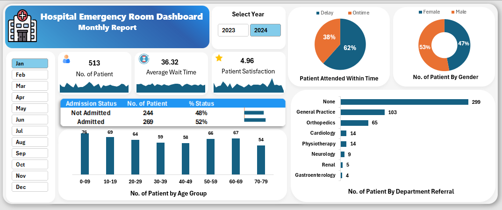

# Hospital Emergency Room Dashboard

## 📌 Project Overview
This project presents an **Excel-based interactive dashboard** for analyzing Emergency Room (ER) performance.  
The dashboard enables hospital administrators and stakeholders to monitor **patient flow, wait times, satisfaction levels, and admission trends** for effective decision-making.

---

## 🎯 Key Features
- **KPI Tracking**:  
  - Total Number of Patients  
  - Average Wait Time (Minutes)  
  - Patient Satisfaction Score  

- **Patient Analysis**:  
  - Admission Status (Admitted vs Not Admitted)  
  - Gender Distribution  
  - Age Group Distribution  

- **Operational Insights**:  
  - Patients Attended Within Time vs Delayed  
  - Department-wise Referrals  

- **Interactivity**:  
  - Yearly and Monthly filters for dynamic reporting  
  - Drill-down views across age groups, gender, and departments  

---

## 🛠️ Tools & Techniques
- **Excel** (Pivot Tables, Charts, Slicers, Data Visualization)  
- **Dashboard Design** with interactive slicers and conditional formatting  

---

## 📊 Dashboard Preview

---

## 📂 Project Structure

---

---

## ✅ Insights
- Helps identify patient wait time patterns and service bottlenecks  
- Monitors admission ratios and departmental referrals  
- Supports decision-making to improve **ER efficiency and patient care**  

---

