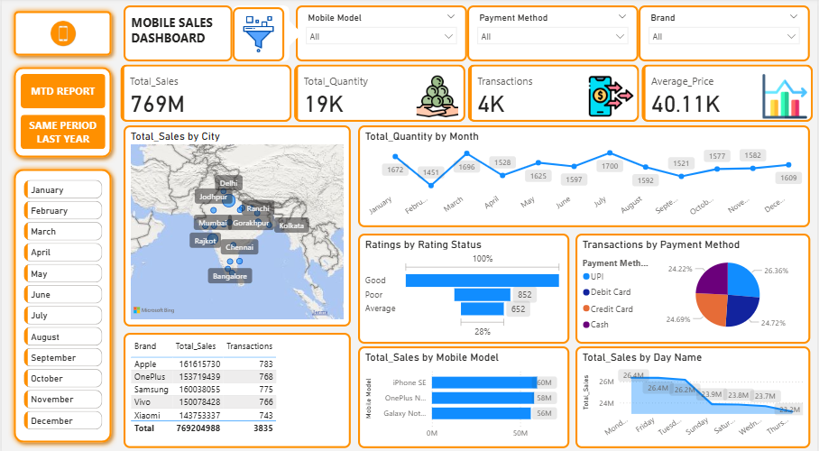
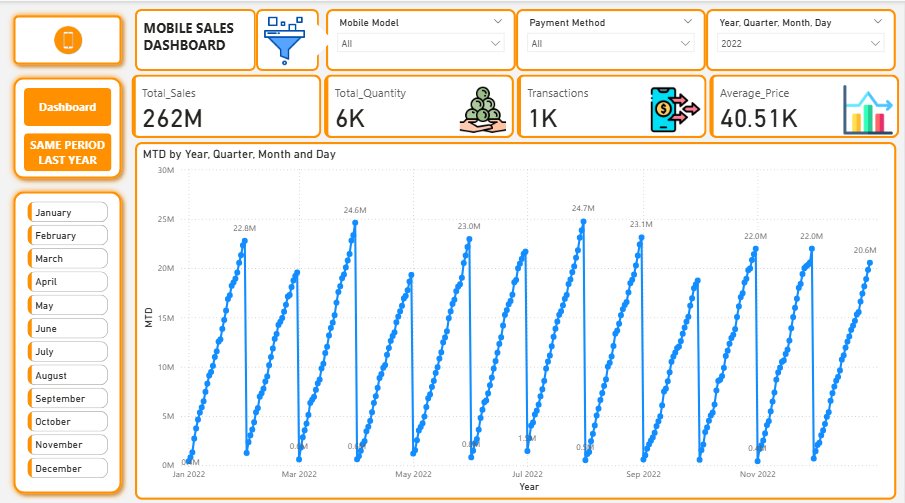
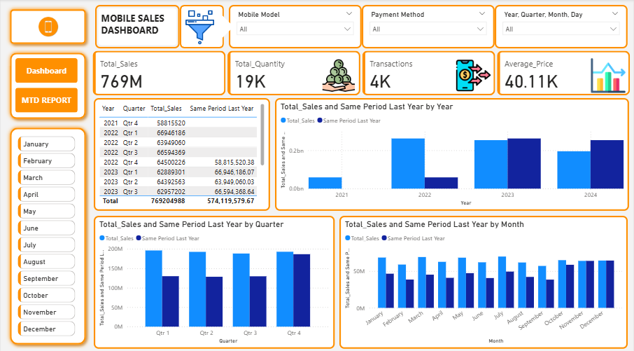

# 📊 Mobile Sales Dashboard — Power BI Project

## 📝 Project Overview
This project analyzes **mobile sales performance** across different cities, brands, and payment methods. The interactive Power BI dashboard provides clear visibility into sales volume, customer transactions, and revenue trends, enabling stakeholders to make data-driven business decisions.

## 🎯 Objective
- Track total sales, quantity, transactions, and average price trends.  
- Compare **Month-to-Date (MTD)** and **Same Period Last Year (SPLY)** performance.  
- Identify top-performing **brands**, **mobile models**, and **cities**.  
- Understand **customer behavior** based on payment method and ratings.

## 📂 Data Source
- Format: Excel (3K+ rows)  
- Columns: `Order Date`, `Brand`, `Mobile Model`, `City`, `Quantity`, `Sales Amount`, `Payment Method`, `Rating`

## 🧰 Tools & Techniques
- Power BI (Data Visualization)  
- Power Query (Data Cleaning & Transformation)  
- DAX (Measures & Calculations)  
- Excel (Source Data)

## 🧮 Key DAX Measures
- Total Sales  
- Total Quantity  
- Total Transactions  
- Average Price  
- MTD (Month-to-Date)  
- SPLY (Same Period Last Year)

Additionally, a **calculated column** `Rating Status` was created to classify customer feedback into categories such as *Good*, *Poor*, and *Average*.

## 📈 Dashboard Features
- 🏙️ **Sales by City** — Interactive map to analyze regional performance.  
- 🧾 **Sales by Brand & Mobile Model** — Top-selling brands and models.  
- 🕒 **Sales Trend by Month & Day** — Clear time-series analysis.  
- 💳 **Transactions by Payment Method** — Customer payment preferences.  
- ⭐ **Customer Ratings** — Quality insight from feedback data.  
- 📅 **MTD & SPLY View** — Easy performance comparison over time.

## 🌟 Business Impact
- Provided quick visibility into **regional and brand-level performance**.  
- Enabled management to **identify seasonal patterns** and sales spikes.  
- Supported strategic **marketing and inventory decisions**.

## 🖼️ Dashboard Preview

 Main Dashboard 

 

 MTD Report 
 
  

 SAME PERIOD LAST YEAR 
 
  

## 🚀 Future Enhancements
- Add dynamic forecasting visuals.  
- Integrate real-time data refresh.  
- Add customer segmentation analysis.

---

👩‍💻 **Author:** *Poonam Gade*  
📍 Data Analyst | Power BI | SQL | Excel | Tableau
